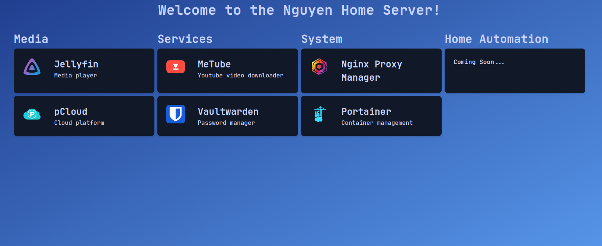

# Homeserver

The docker-compose and frontend files that I use for my home server, running Ubuntu 20.04

## Services Included:

### Media

- [Jellyfin](https://hub.docker.com/r/linuxserver/jellyfin) - media server
- [pCloud](https://www.pcloud.com/) - cloud platform

### Services

- [MeTube](https://github.com/alexta69/metube) - YouTube video downloader
- [Vaultwarden](https://hub.docker.com/r/vaultwarden/server) - FOSS password manager using Bitwarden implementation

### System

- [Nginx Proxy Manager](https://nginxproxymanager.com/)
- [Portainer](https://www.portainer.io/) - Docker container management
